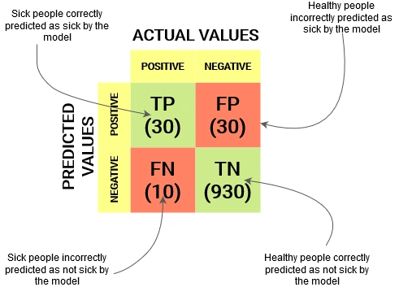

### Enhanced README

---

# Sleep Health and Lifestyle Analysis

## Table of Contents

- [Overview](#overview)
- [Dataset](#dataset)
- [Data Preprocessing](#data-preprocessing)
- [Exploratory Data Analysis (EDA)](#exploratory-data-analysis-eda)
- [Statistical Analysis](#statistical-analysis)
- [Machine Learning Models](#machine-learning-models)
  - [Model Evaluation](#model-evaluation)
  - [Hyperparameter Tuning](#hyperparameter-tuning)
- [Confusion Matrix Visualization](#confusion-matrix-visualization)
- [Requirements](#requirements)
- [How to Run the Code](#how-to-run-the-code)
- [Conclusion](#conclusion)

## Overview

This project analyzes sleep patterns and their correlation with various health metrics using machine learning techniques. By examining the relationship between sleep duration, stress levels, and other health indicators, the project aims to predict the presence of sleep disorders among individuals. This analysis can aid in identifying high-risk populations and informing interventions.

## Dataset

The dataset contains various features related to sleep health and lifestyle choices. Key columns include:

- **Gender**: Categorical variable indicating gender.
- **Occupation**: Categorical variable indicating occupation.
- **BMI Category**: Categorical variable indicating Body Mass Index classification.
- **Blood Pressure**: Numerical value indicating blood pressure.
- **Sleep Disorder**: Target variable indicating the presence of a sleep disorder.
- **Sleep Duration**: Numerical value representing average sleep duration.
- **Stress Level**: Numerical value indicating daily stress level.

### Example Data

| Gender | Occupation | BMI Category | Blood Pressure | Sleep Disorder | Sleep Duration | Stress Level |
|--------|------------|--------------|----------------|----------------|----------------|--------------|
| Male   | Engineer   | Normal       | 120            | No             | 7              | 3            |
| Female | Teacher    | Overweight   | 135            | Yes            | 5              | 7            |

## Data Preprocessing

### Steps Taken:

1. **Loading the Data**: The dataset is loaded using Pandas, providing a DataFrame structure for easier manipulation.
2. **Handling Missing Values**: A preliminary check is conducted to identify and quantify missing values across all columns, with potential strategies for imputation discussed.
3. **Encoding Categorical Variables**: Categorical variables are converted to numerical codes using `astype('category').cat.codes`, facilitating machine learning model training.
4. **Feature Scaling**: Although not explicitly included, future iterations could benefit from scaling numerical features to improve model convergence.

## Exploratory Data Analysis (EDA)

EDA is conducted to gain insights into the dataset:

- **Histograms**: Visualize the distribution of sleep duration with a Kernel Density Estimate (KDE) overlay.
- **Box Plots**: Highlight potential outliers in sleep duration.
- **Scatter Plots**: Examine relationships between sleep duration and stress levels.
- **Correlation Heatmap**: Analyze correlations among features.

## Statistical Analysis

### Correlation Metrics

- **Pearson Correlation**: Measures linear relationships between sleep duration and blood pressure.
- **Spearman Correlation**: Assesses monotonic relationships.

### Regression Analysis

- A regression plot visualizes the relationship between sleep duration and blood pressure.

## Machine Learning Models

Multiple models are employed to predict sleep disorders:

1. **Logistic Regression**
2. **Decision Tree Classifier**
3. **Random Forest Classifier**
4. **AdaBoost Classifier**
5. **Recursive Feature Elimination (RFE)**

### Model Evaluation

Models are evaluated using:

- **Classification Reports**: Detailing precision, recall, F1-score, and support for each class.
- **ROC AUC Scores**: Provides a single metric for assessing model performance.

### Hyperparameter Tuning

**Grid Search** is applied to optimize hyperparameters for the Random Forest Classifier.

## Confusion Matrix Visualization

Confusion matrices are generated for each model to visualize performance metrics, including true positives, false positives, true negatives, and false negatives.

### Sample Confusion Matrix



## Requirements

To run this project, you will need the following Python libraries:

```plaintext
pandas
numpy
matplotlib
seaborn
scipy
scikit-learn
```

Install the required packages using:

```bash
pip install -r requirements.txt
```

## How to Run the Code

1. Clone the repository to your local machine:
   ```bash
   git clone <repository-url>
   cd <repository-directory>
   ```

## Conclusion

This project demonstrates the application of data analysis and machine learning techniques to investigate sleep health patterns. It highlights the importance of sleep duration in relation to health indicators and the effectiveness of various models in predicting sleep disorders. Insights derived from this analysis could inform public health strategies aimed at improving sleep health.
